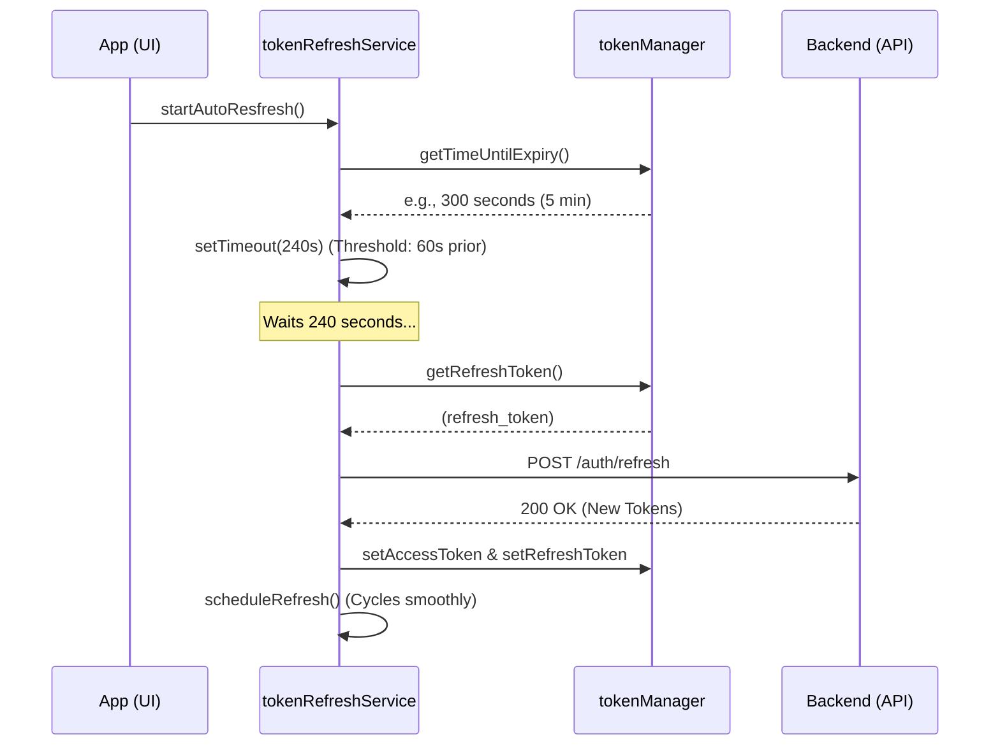
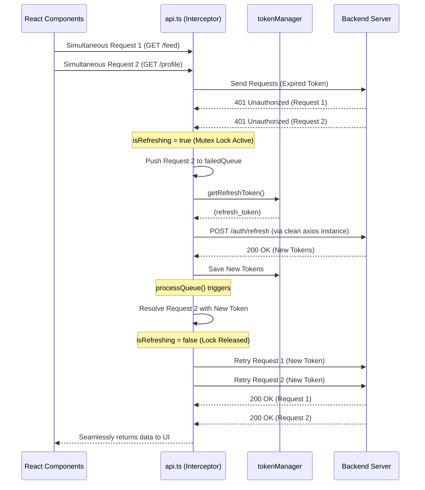

# 🏗️ React Native Expo Enterprise Boilerplate


A production-ready, enterprise-grade **React Native (Expo)** boilerplate featuring advanced state management, file-based routing, and an ultra-robust **Dual-Layer Authentication & Token Lifecycle** architecture. Designed to solve common mobile networking bottlenecks, race conditions, and state synchronization challenges out of the box.

---

## 📱 UI & Screenshots

<!-- INSERT SCREENSHOTS HERE -->

---

## 🛠️ Tech Stack

* **Core Framework:** [React Native](https://reactnative.dev/) & [Expo](https://expo.dev/)
* **Navigation:** [Expo Router](https://docs.expo.dev/router/introduction/) (File-based navigation)
* **Language:** [TypeScript](https://www.typescriptlang.org/) for complete type safety
* **Client State Management:** [Zustand](https://github.com/pmndrs/zustand) (Lean, fast, global UI & session state)
* **Server State Management:** [TanStack React Query v5](https://tanstack.com/query/latest) (Caching, background synchronization, deduplication)
* **Styling:** [NativeWind](https://www.nativewind.dev/) (Tailwind CSS for React Native)
* **Secure Storage:** Expo Secure Store / React Native Keychain
* **Networking:** Axios with custom dual-layer interceptor architecture

---

## 🌟 Key Features & Architectural Highlights

### 🔐 1. Advanced Auth & Token Lifecycle
* **App Bootstrap & Splash Control (`useAppReady.ts`):** Smooth transition from launch to UI rendering. Holds the native splash screen while asynchronously validating secure tokens and hydrating the user profile in Zustand.
* **Dual-Layer Token Refresh Strategy:**
  * **Proactive Auto-Refresh (`tokenRefreshService.ts`):** Automatically schedules a background token refresh 60 seconds (`REFRESH_THRESHOLD`) before token expiration, guaranteeing zero API interruption during active app usage.
  * **Reactive Interceptor & Race Condition Handling (`api.ts`):** Handles background awakening or deep sleep 401 errors. Employs a robust request queue & lock mechanism (`isRefreshing`) to intercept simultaneous failing requests, refresh the token once, and automatically replay all queued requests with updated credentials.

### 🔄 2. Flawless State Synchronization
* **Client / Server Separation:** Pristine separation between ephemeral UI state (modals, active themes, local filters) via **Zustand** and persistent asynchronous API data via **TanStack React Query v5**.
* **Automatic Cache Invalidation & GC:** Fully leverages React Query v5's `gcTime` and `staleTime`. Unmounted screen observers are cleanly handed to the garbage collector to prevent memory over-allocation in mobile environments.

### 🧭 3. Enterprise Navigation & Memory Leak Prevention
* **File-Based Routing:** Clean separation between `app/(auth)` and `app/(protected)/(tabs)` layout structures.
* **Expo Router Keep-Alive Optimization:** Custom architecture built around Expo Router's bottom-tab memory persistence. Uses `useFocusEffect` instead of standard `useEffect` to manage active screen triggers, cleanly subscribing/unsubscribing to WebSockets, Firebase, or `DeviceEventEmitter` listeners to eliminate memory leaks.
* **App Status Awareness:** Deep handling of iOS/Android background/foreground transitions, triggering `refetchOnWindowFocus` and socket reconnection logic with Exponential Backoff upon app wake.

---

## 🚀 Getting Started

Follow these steps to set up, install, and run the project locally on your machine.

### 📋 Prerequisites

Before you begin, ensure you have the following installed:
* **[Node.js](https://nodejs.org/)** (v18 or newer recommended)
* **[Expo CLI / Expo Go](https://expo.dev/)** installed on your iOS/Android device or simulator.
* **Package Manager:** `yarn`, `npm`, or `pnpm`

### 1️⃣ Clone the Repository

```bash
git clone https://github.com/your-username/your-repository-name.git
cd your-repository-name
```

### 2️⃣ Install Dependencies

Choose your preferred package manager to install the required dependencies:

```bash
# Using Yarn (Recommended)
yarn install

# Or using NPM
npm install

# Or using PNPM
pnpm install
```

### 3️⃣ Environment Configuration

Create a `.env` file in the root directory of the project. You can copy the template from `.env.example` if available:

```bash
cp .env.example .env
```

Ensure your `.env` file contains your local or staging backend API URLs:

```env
EXPO_PUBLIC_API_URL=https://api.yourdomain.com/v1
EXPO_PUBLIC_REFRESH_THRESHOLD=60
```

### 4️⃣ Start the Development Server

Launch the Expo development server:

```bash
npx expo start
```

* **Press `i`** to open the project in the **iOS Simulator**.
* **Press `a`** to open the project in the **Android Emulator**.
* **Scan the QR Code** with your mobile device using the **Expo Go** app (Android) or the Camera app (iOS).

---

## 📐 Architectural Workflows & Sequence Diagrams

### 🛡️ Scenario A: Proactive Background Refresh (Timer-Based)
Executes silently in the background while the user actively interacts with the application.



### 🛟 Scenario B: Reactive Interceptor & Queue Management
Executes when the app awakens from the background after the timer has lapsed, intercepting simultaneous failing requests.



---

## 🤝 Contributing

Contributions, issues, and feature requests are welcome! 
Feel free to check the [issues page](https://github.com/your-username/your-repository-name/issues) if you want to contribute.

---

## 📄 License

This project is licensed under the [MIT License](LICENSE).
